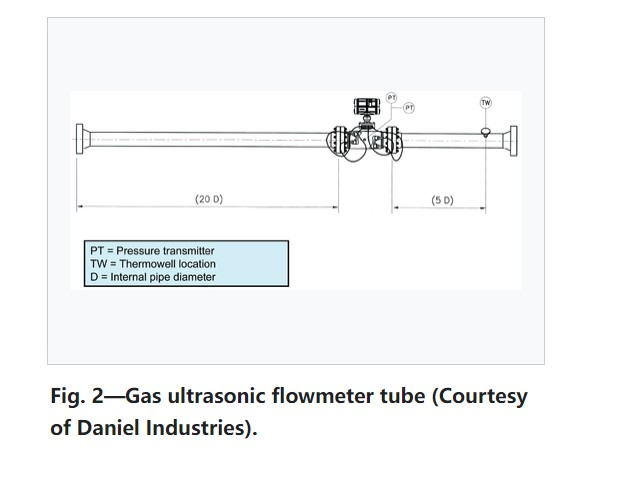

**1. (5 points) Describe the instruments (at least 5 types) for the measurement of 
velocity, flow rate and pressure of gases (e.g., their working principles) 
2. (5 points) Describe the instruments (at least 3 ones) that rely on settling velocity**

1.  
 - **Ultrasonic gas meters**
  
  USMs derive the volume flow of the gas by measuring the transit times of high-frequency sound waves. Transit times are measured for pulses propagating up and downstream across the gas stream at an angle with respect to the pipe axis. These transit times, together with the meter geometry, are used to calculate the average gas velocity on a particular chord. Multiple paths are used within ultrasonic meters to maximize accuracy in the overall average velocity measurement. These multiple paths also provide a certain degree of immunity to flow profile effects, such as asymmetry and swirl. The level of immunity offered by the multipath USM varies from one design to another, as shown by Grimley.
  
  *resource:https://petrowiki.spe.org/Ultrasonic_gas_meters*

  
 - **Vortex flowmeter**

    Vortex flowmeter is a flowmeter for measuring fluid flow rates in an enclosed conduit.

    A vortex flowmeter comprising: a flow sensor operable to sense pressure variations due to vortex-shedding of a fluid in a passage and to convert the pressure variations to a flow sensor signal, in the form of an electrical signal;and a signal processor operable to receive the flow sensor signal and to generate an output signal corresponding to the pressure variations due to vortex-shedding of the fluid in the passage.

    When the medium flows through the Bluff body at a certain speed, an alternately arranged vortex belt is generated behind the sides of the Bluff body, called the "von Kármán vortex". Since both sides of the vortex generator alternately generate the vortex, the pressure pulsation is generated on both sides of the generator, which makes the detector produce alternating stress. The piezoelectric element encapsulated in the detection probe body generates an alternating charge signal with the same frequency as the vortex, under the action of alternating stress. The frequency of these pulses is directly proportional to flow rate. The signal is sent to the intelligent flow totalizer to be processed after being amplified by the pre-amplifier.

     *equation*
     $$
     f = \frac{S t \times V}{d}
     $$

  *resource:https://en.wikipedia.org/wiki/Vortex_flowmeter*

 - **Thermal gas flowmeter**
  Thermal gas m  ass flowmeter is an instrument that uses the principle of thermal diffusion to measure gas flow. The sensor consists of two reference grade thermal resistors (RTDS). One is the speed sensor RH, and the other is the temperature sensor RMG, which measures the temperature change of the gas. When these two RTDS are placed in the gas under test, one sensor RH is heated and the other sensor RMG is used to sense the temperature of the gas under test. As the gas velocity increases, the airflow carries away more heat, and the temperature of the sensor RH decreases.

 *resource:https://baike.baidu.com/item/%E7%83%AD%E5%BC%8F%E6%B0%94%E4%BD%93%E8%B4%A8%E9%87%8F%E6%B5%81%E9%87%8F%E8%AE%A1/958816*

 - **Mercury barometers**
  A mercury barometer is an instrument used to measure atmospheric pressure in a certain location and has a vertical glass tube closed at the top sitting in an open mercury-filled basin at the bottom. Mercury in the tube adjusts until the weight of it balances the atmospheric force exerted on the reservoir. High atmospheric pressure places more force on the reservoir, forcing mercury higher in the column. Low pressure allows the mercury to drop to a lower level in the column by lowering the force placed on the reservoir. Since higher temperature levels around the instrument will reduce the density of the mercury, the scale for reading the height of the mercury is adjusted to compensate for this effect. The tube has to be at least as long as the amount dipping in the mercury + head space + the maximum length of the column.

  - **Vacuum pump oil barometer**
   Using vacuum pump oil as the working fluid in a barometer has led to the creation of the new "World's Tallest Barometer" in February 2013. The barometer at Portland State University (PSU) uses doubly distilled vacuum pump oil and has a nominal height of about 12.4 m for the oil column height; expected excursions are in the range of ±0.4 m over the course of a year. Vacuum pump oil has very low vapour pressure and it is available in a range of densities; the lowest density vacuum oil was chosen for the PSU barometer to maximize the oil column height.

*resource:https://en.wikipedia.org/wiki/Barometer*
2.  